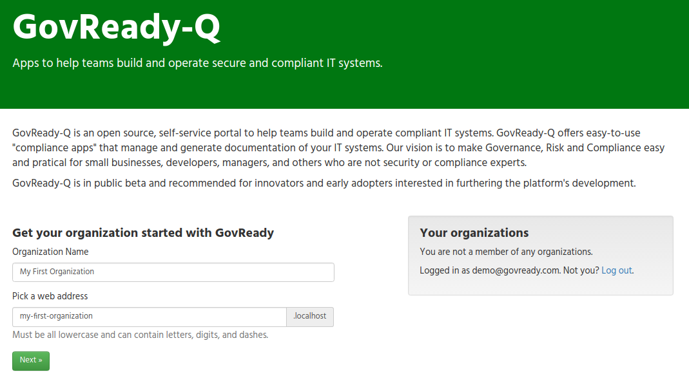

# GovReady-Q Compliance Server

GovReady-Q Compliance Server is an open source tool to help teams build and operate compliant IT systems.

1. [About GovReady-Q Compliance Server](#about-govready-q) 
1. [Installing Locally / Development](#development)
1. [About Compliance Apps](#about-apps)
1. [Creating GovReady-Q Compliance Apps using the Docker version](#creating-apps)
1. [Automation API](#automation)
1. [Testing and Generating Screenshots](#testing)
1. [Deployment Guides](#deployment)
1. [License and Credits](#license)

# About GovReady-Q Compliance Server

GovReady-Q offers easy-to-use "compliance apps" that manage and generate documentation of your IT systems. Compliance apps represent system components, organization processes and team roles. When using GovReady-Q, your IT project teams select "apps" from a compliance store. The apps interactively teach security and ask simple questions about your software and system. As you pick apps and collaboratively answer questions with your team, GovReady-Q analyzes and tracks your system's compliance and maintains human- and machine-readable versions of your compliance documentation.

GovReady-Q can be used on its own or as a complement to an organization's existing GRC software providing step-by-step guidance and pre-written control implementation descriptions.

GovReady-Q is in public beta and recommended for innovators and early adopters interested in furthering the platform's development.

Our vision is to make Governance, Risk and Compliance (GRC) easy and practical for small businesses, developers, managers, and others who are not security or compliance experts.

GovReady-Q is open source and incorporates the emerging [OpenControl](http://open-control.org) data standard for reusable compliance content.

The easiest way to get started with GovReady-Q is to launch Q through Docker. See our [Launching with Docker](deployment/docker/README.md) guide to get started.

[Join our mailing list](http://eepurl.com/cN7oJL) and stay informed of developments.

# Instally Locally / Development

Q is developed in Python 3 on top of Django.

## Preparing your development environment

To develop locally, run the following commands to set up your development environment:

	# install python3 and pip appropriately for your environment
	# below command demonstrates Ubuntu
	sudo apt-get install python3-pip unzip libssl-dev pandoc wkhtmltopdf # or appropriate for your system
	
	# clone repo
	git clone https://github.com/GovReady/govready-q
	
	# install dependencies
	pip3 install -r requirements.txt
	./fetch-vendor-resources.sh
	
	# set up database (sqlite3 will be used until you configure another database)
	python3 manage.py migrate
	python3 manage.py load_modules

    # A default AppSource for https://github.com/GovReady/govready-sample-apps.
    python3 manage.py loaddata deployment/docker/appsources.json

Then create your admin account:

	python3 manage.py createsuperuser

And start the debug server:

	python3 manage.py runserver

On your first run, you'll be prompted to copy some JSON data into a file at `local/environment.json` like this:

    {
      "debug": true,
      "host": "localhost:8000",
      "https": false,
      "secret-key": "...something here..."
    }

This file is important for persisting login sessions, and you can provide other Q settings in this file.

## Create an organization

Q is designed for the enterprise, so all end-user interactions with Q are on segregated subdomains called "organizations". You must set up the first organization.

Visit [http://localhost:8000/](http://localhost:8000) and sign in with the superuser account that you created above. Then on the left side of the page, create your first organization:

Follow the instructions to visit your site's subdomain, e.g. at [http://my-first-organization.localhost:8000](http://my-first-organization.localhost:8000). We recommend using Google Chrome at this point. Other browsers will not be able to resolve organization subdomains on `localhost` unless you add `127.0.0.1 my-first-organization.localhost` [to your hosts file](https://support.rackspace.com/how-to/modify-your-hosts-file/).

When you log in for the first time it will ask you questions about the user and about the organization.

## Invitations on local systems

You will probably want to try the invite feature at some point. The debug server is configured to dump all outbound emails to the console. So if you "invite" others to join you within the application, you'll need to go to the console to get the invitation acceptance link.

## Updating the source code

To update the source code from this repository you can `git pull`. You then may need to re-run some of the setup commands:

	git pull
	pip3 install -r requirements.txt
	./fetch-vendor-resources.sh
	python3 manage.py migrate
	python3 manage.py load_modules

#  About Compliance Apps

Cyber security compliance would be easier and less time consuming if the components of our IT systems automatically generated the paperwork auditors want.

That's the idea behind GovReady Compliance Apps: reusable data packages mapping your IT system components to compliance controls so software maintains the paperwork, allowing your people to get back to improving security and managing risk.

Compliance apps map IT System components to compliance controls. A "component" can be any part of a system that contributes to its operation -- including organizational processes. Compliance apps collect and assess information about one or more system components and translate that information to compliance documentation.

Compliance apps are data definitions written in YAML. Organizations can and should plan to develop their own compliance apps, just as they would develop their own configuration files. The principal benefit of compliance apps is their modularization and reusability.

Content in GovReady-Q is organized around apps and modules:

* A "module" is a linear sequence of questions that produces zero or more output documents.
* An "app" is a collection of modules, one of which is named "app" that defines the layout of the app when it is started by a user.
* A "top level" app is a special type of app that contains slots for various "component" apps that together define the architecture of a type of IT System.

The typical user experience will be to first pick a "top level" app from the compliance catalog that is representative of your IT System, then pick the "component" apps that represent the specific components of the IT System, and then iteratively complete the questions within the component apps' modules.

The diagram below depicts an exploded view of the relationships between a top level app to a component app and to modules and questions.

Modules are stored in YAML files. Built-in apps and modules are stored inside the `modules` directory in this repository. Other apps and modules are stored in other repositories that can be linked to a Q deployment through the `AppSource` model in the Django admin.

GovReady-Q currently installs with a small set of compliance apps primarily for demonstration purposes.

See [Apps.md](Apps.md) for documentation on creating apps and having them appear in the GovReady-Q app catalog.

See [Schema.md](Schema.md) for documentation on writing modules, which contain questions.

#  Creating GovReady-Q Compliance Apps using the Docker version

To create your own compliance apps, visit the [step-by-step guide to creating compliance apps using the Docker version of the GovReady-Q Commpliance Server](deployment/docker/CreatingApps.md).

This guide shows you how to:

* Start and configure the Docker version of GovReady-Q
* Create a compliance app
* Edit a compliance app's YAML files
* Edit a compliance app using GovReady-Q's authoring tools
* Deploying the app to a production instance of GovReady-Q and storing apps in a source code version control repository

#  Automation API

The GovReady-Q Compliance Server provides and Automation API to enable your existing scanners, configuraiton management tools, and even system components to directly update the compliance apps.

The Automation API saves tremendous time initially collecting information and ensures your compliance documentation is continuously synchronized with the actual state of your systems.

See [Automation.md](Automation.md) for documentation on using the API to automatically gather information and update documentation.

#  Testing and Generating Screenshots

## Development and Testing

To run the integration tests, you'll also need to install chromedriver:

	sudo apt-get install chromium-chromedriver   (on Ubuntu)
	brew install chromedriver                    (on Mac)

Then run the test suite with:

	./manage.py test

We also have continuous integration set up with CircleCI at https://circleci.com/gh/GovReady/govready-q.

Our `requirements.txt` file is designed to work with `pip install --require-hashes`, which ensures that every installed dependency matches a hash stored in this repository. The option requires that every dependency (including dependencies of dependencies) be listed, pinned to a version number, and paired with a hash. We therefore don't manually edit `requirements.txt`. Instead, we place our immediate dependencies in `requirements.in` and run `requirements_txt_updater.sh` (which calls pip-tools's pip-compile command) to update the `requirements.txt` file for production.

Continuous integration performs sanity and security checks on our dependencies. (1) It runs `requirements_txt_checker.sh` which ensures `requirements.txt` is in sync with `requirements.in`. (2) It checks that there are no known vulnerabilities in the dependencies using [pyup.io](https://pyup.io/). (3) It checks that all packages are up to date with upstream sources (unless the package and its latest upstream version are listed in `requirements_txt_checker_ignoreupdates.txt`).

# Deployment Guides

Deployment guides for installing and deploying GovReady-Q on different Operating Systems can be found the `deployment` directory.

* [Launching with Docker](deployment/docker/README.md) - super easy and has a nice `first_run.sh` script
* [Installing on RHEL](deployment/rhel/README.md) - detailed instructions on installing, libraries, setting up Postgres and Apache
* [Installing on Ubuntu](deployment/ubuntu/README.md) - super easy `update.sh`

A production system may need to set more options in `local/environment.json`. Here are recommended settings:

	{
	  "debug": false,
	  "admins": [["Name", "email@domain.com"], ...],
	  "host": "q.<yourdomain>.com",
	  "organization-parent-domain": "<yourdomain>.com",
	  "organization-seen-anonymously": false,
	  "https": true,
	  "secret-key": "something random here",
	  "static": "/root/public_html"
	}

# License / Credits

This repository is licensed under the [GNU GPL v3](LICENSE.md).

Emoji icons by http://emojione.com/developers/.

Generic server icon by [Stock Image Folio from Noun Project](https://thenounproject.com/search/?q=computer&i=870428)

