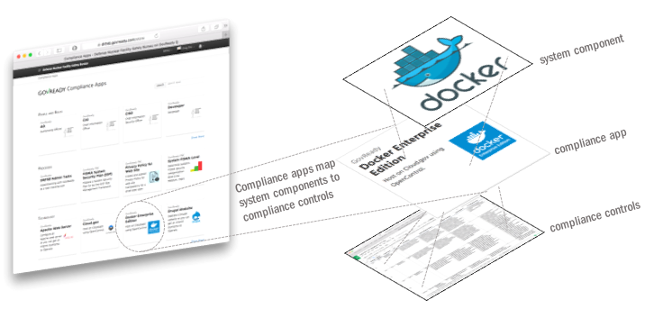

# GovReady-Q Compliance Server

GovReady-Q Compliance Server is an open source tool to help teams build and operate compliant IT systems.

1. [About GovReady-Q Compliance Server](#about-govready-q) 
1. [Installing](#install)
1. [About Compliance Apps](#about-apps)
1. [Creating GovReady-Q Compliance Apps](#creating-apps)
1. [Automation API](#automation)
1. [Testing](#testing)
1. [Deployment](#deployment)
1. [License and Credits](#license)

# About GovReady-Q Compliance Server

GovReady-Q offers easy-to-use "compliance apps" that manage and generate documentation of your IT systems. Compliance apps represent system components, organization processes and team roles.

As you pick apps and collaboratively answer questions with your team, GovReady-Q analyzes and tracks your system's compliance and maintains human- and machine-readable versions of your compliance documentation.

GovReady-Q can be used on its own or as a complement to an organization's existing GRC software providing step-by-step guidance and pre-written control implementation descriptions.

GovReady-Q is in public beta and recommended for innovators and early adopters interested in furthering the platform's development.

Our vision is to make Governance, Risk and Compliance (GRC) easy and practical for small businesses, developers, managers, and others who are not security or compliance experts.

GovReady-Q is open source and incorporates the emerging [OpenControl](http://open-control.org) data standard for reusable compliance content.

[Join our mailing list](http://eepurl.com/cN7oJL) and stay informed of developments.

#  Installation

See [installation on workstations for development](deployment/local/README.md) and other [deployment guides](deployment/README.md) for other environments.

#  About Compliance Apps

Cyber security compliance would be easier and less time consuming if the components of our IT systems automatically generated the paperwork auditors want.

That's the idea behind GovReady Compliance Apps: reusable data packages mapping your IT system components to compliance controls so software maintains the paperwork, allowing your people to get back to improving security and managing risk.

Compliance apps map IT System components to compliance controls. A "component" can be any part of a system that contributes to its operation -- including organizational processes. Compliance apps collect and assess information about one or more system components and translate that information to compliance documentation.

Compliance apps are data definitions written in YAML. Organizations can and should plan to develop their own compliance apps, just as they would develop their own configuration files. The principal benefit of compliance apps is their modularization and reusability.

Content in GovReady-Q is organized around apps and modules:

* A "module" is a linear sequence of questions that produces zero or more output documents.
* An "app" is a collection of modules, one of which is named "app" that defines the layout of the app when it is started by a user.
* A "top level" app is a special type of app that contains slots for various "component" apps that together define the architecture of a type of IT System.

The typical user experience will be to first pick a "top level" app from the compliance catalog that is representative of your IT System, then pick the "component" apps that represent the specific components of the IT System, and then iteratively complete the questions within the component apps' modules.

The diagram below depicts an exploded view of the relationships between a top level app to a component app and to modules and questions.

Modules are stored in YAML files. Built-in apps and modules are stored inside the `modules` directory in this repository. Other apps and modules are stored in other repositories that can be linked to a Q deployment through the `AppSource` model in the Django admin.

GovReady-Q currently installs with a small set of compliance apps primarily for demonstration purposes.

See [Apps.md](docs/Apps.md) for documentation on creating apps and having them appear in the GovReady-Q app catalog.

See [Schema.md](docs/Schema.md) for documentation on writing modules, which contain questions.

#  Creating GovReady-Q Compliance Apps

To create your own compliance apps, visit the [step-by-step guide to creating compliance apps using the Docker version of the GovReady-Q Commpliance Server](docs/CreatingApps.md).

This guide shows you how to:

* Start and configure the Docker version of GovReady-Q
* Create a compliance app
* Edit a compliance app's YAML files
* Edit a compliance app using GovReady-Q's authoring tools
* Deploying the app to a production instance of GovReady-Q and storing apps in a source code version control repository

#  Automation API

The GovReady-Q Compliance Server's Automation API enables your scanners, configuration management tools, and system components to continuously access and maintain compliance artifacts.

See [Automation documentation](docs/Automation.md).

##  Testing

See [Testing documentation](docs/Test.md).

# Deployment

See [Deployment documentation](deployment).

# License / Credits

This repository is licensed under the [GNU GPL v3](LICENSE.md).

* Emoji icons by http://emojione.com/developers/.
* Generic server icon by [Stock Image Folio from Noun Project](https://thenounproject.com/search/?q=computer&i=870428).

