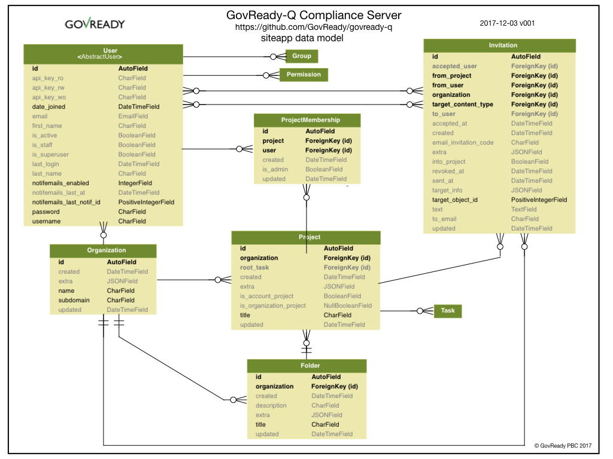
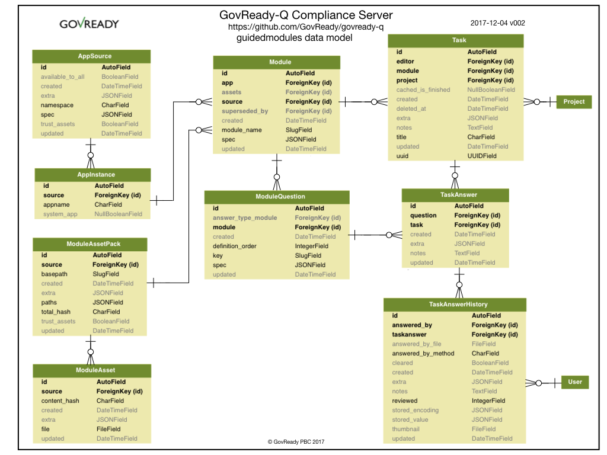
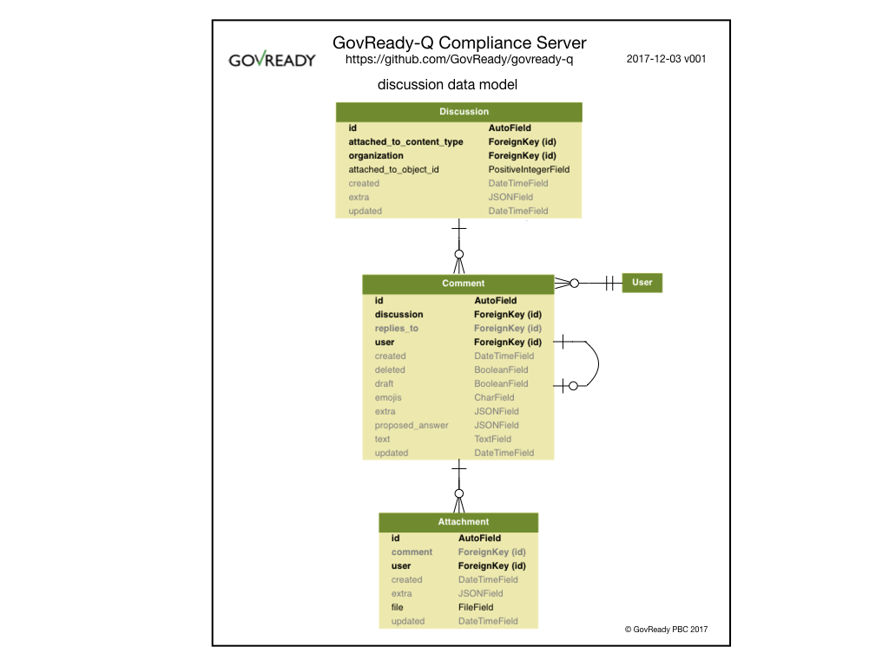

Deveoper Guide
================================

Documentation for developers of GovReady-Q Compliance Server.

# Overview

GovReady-Q Compliance Server is a GRC platform for creating automated compliance processes ranging from gathering information from persons and computers to generating compliance artifacts.

Unlike other GRC software, GovReady-Q was designed for modern software practices such as Agile, DevOps, and Infrastructure-as-Code.

The GovReady Compliance ecosystem consists of the following:

1. GovReady-Q Compliance Server - an open source server and collaboration platform gathering information and generating artifacts
1. GovReady Compliance Apps - customizable "images" of modules, questions, tasks, and artifact templates
1. GovReady Automation API - GovReady-Q Server's RESTful API for adding evidence and results
1. OpenControl - an emerging standard for expressing control implementation information in machine readable format
1. ComplianceLib - a Python library for modeling controls and control catalogs

# GovReady-Q Django Apps

The GovReady-Q Compliance Server is a Django Project consisting of three interacting Django Apps:

1. `siteapp` - handles Users, Organizations, Projects and Folders, Invitations
1. `guidedmodules` - handles Compliance Apps, Modules and Questions, (Tasks,) Answers, Instrumentation
1. `discussion` - handles Discussions, Comments, Invitations

Both `siteapp` and `discussion` are fairly intuitive in what they do and how they work. The `guidedmodules` app is the most sophisticated and least intuitive of the three and provides the core functionality of the GovReady Compliance Server.

## Siteapp

The diagram below provides a summary representation of GovReady-Q's Django siteapp data model that handles users, organizations, projects and folders, and invitations.



GovReady-Q is multi-tenant. The siteapp data model represents users who are uniquely associated with an oragnization and have membership in different organization projects. Users must be invited to projects.

Access control is based on organization and projects. Information cannot be shared acrossed organizations and only limited information can be shared across projects within an organization.


## Guidedmodules

The diagram below provides a summary representation of GovReady-Q's Django guidedmodules data model that handles Compliance Apps, modules and questions, (tasks,) answers, and instrumentation. 



The best way to understand the guidedmodule data model is to think of a questionnaire. A questionnaire contains multiple questions. Questions can be grouped into modules. A questionnaire and its modules can contain different types of questions. Each question has an answer.

This description suggests a simple "questionnaire-question-answer" database model, yet the diagram does not seem to have tables for "Questionnaire" or "Question" or "Answer."

That's because we have a few special demands for our questionnaire that will require a bit of creative thinking and a few abstractions. Some of the additional requirements are:

* blank questionaires are reusable and can be easily loaded into different installs of the database at different organizations;
* anyone can author questionnaires and blank questionnaires can be kept private or shared publicly;
* one questionnaire's answers can be accessed and used by another questionnaire if the questionnaires are part of the same project;
* arbitrary questionnaires can be associated with the same project; so we won't know up front which answers can be shared;
* support a question type whose answer is another questionnaire;
* allow blank questionnaires to be versioned, answered questionnaires to be updated in non-destructive ways, and preserve answered questionnaires last multiple years,
* allow the answer to questions to change while preserving a complete history of answers,
* support assigning modules and questions to different users to answer.

The first bit of creative thinking is to collapse the concepts of "questionnaire" and "module." A questionnaire is a module that contains a list of questions or a list of modules. We represent both "questionnaires" and "modules" as "modules."

The second bit of creative thinking is viewing a "question" also as a kind of "task" whose undertaking results in a value to be stored. When we assign a question (or a module) to a user, we are tasking that user to produce a value that is the answer to the question.

The simple "questionnaire-question-answer" model now transforms into a more abstract "module-task-taskanswer" model. 

To this "module-task-taskanswer" model we introduce an abstraction to deal with tasks whose taskanswer are other modules and another abstraction of taskanswerhistory to retain a complete history of taskanswers.

In the new "module-task-taskanswer" model with complete history, it makes sense that the field `stored_value` in the table `TaskAnswerHistory` would have the actual value of the completed task (e.g., the question's answer).

We next add another abstraction of an "App" as a kind of wrapper around one or more modules to make it easier to create a reusable package that stores our "blank questionnaires" for sharing outside of a given instance of the database. When the resuable "App" package is consumed by GovReady-Q Compliance Server, an "AppInstance" is created in the database cloning the published "App" into the database. Instantiating the "App" in the database enables any updates and fixes to the "App" to be granually ignored or applied to the stored instance. The concept of an "App Source" is introduced to support exchanging "Apps" peer-to-peer.

Lastly, we might want images and other assets for our modules and their tasks, hence the "ModuleAssetPack" and "ModuleAsset" tables.

This might all seem a long way from compliance, but it is not. Compliance is the discipline of scaling attestation and verification. To be compliant, an entity (i.e., a project or an organization) attests to how it completed multiple tasks in a manner that can be verified.


## Discussion

The diagram below provides a summary representation of GovReady-Q's Django discussion data model that handles discussions, comments, and invitations.



A single discussion can be instantiated and associated to any task (task ~= "question"). A discussion can have multiple comments. Comments can have multiple attachments.


# Information System Profile


# Developer Tools

### Generating Detailed Data Models

Below are instructions to use `django-extensions` to generate detailed data models.

```
# Install django-extensions
# http://django-extensions.readthedocs.io/en/latest/installation_instructions.html
pip3 install django-extensions

# Add django-extensions INSTALLED_APPS in siteapp > settings.py
# INSTALLED_APPS = (
#    ...
#    'django_extensions',
# )

# You may need to install pyparsing
pip3 install pyparsing

# examples:
python3 manage.py graph_models -a -g -o my_project_visualized.png
python3 manage.py graph_models -a -o my_project.png
python3 manage.py graph_models -a > my_project.dot
# for a single django app:
python3 manage.py graph_models app1 -o my_project_app1.png
```

