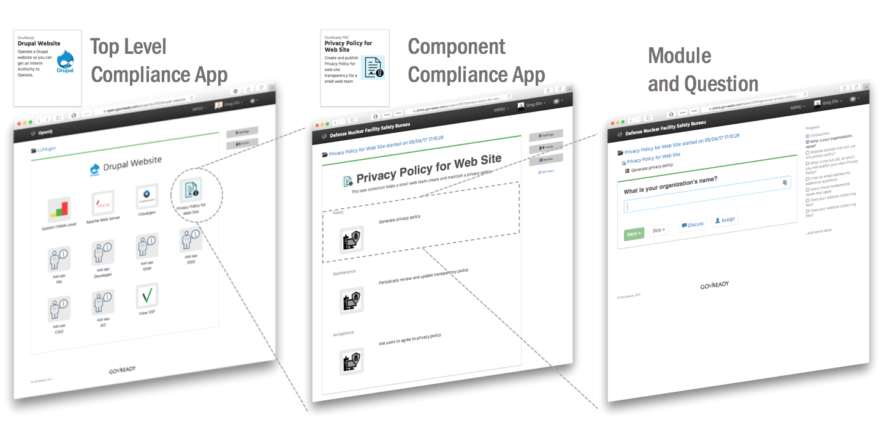
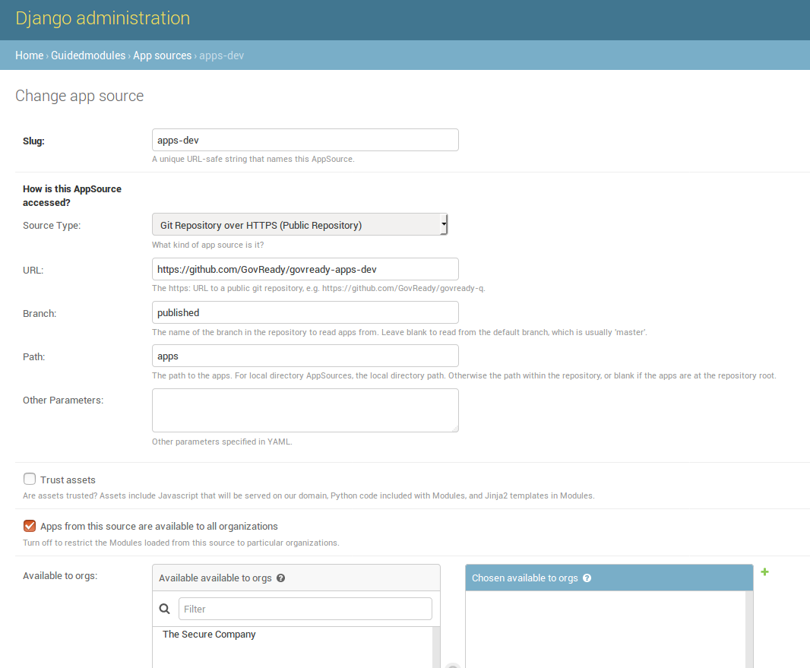

# Understanding Compliance Apps

Compliance apps map IT System components to compliance controls. A "component" can be any part of a system that contributes to its operation including organizational processes.

Compliance apps collect and assess information about one or more system components and translate that information to compliance documentation.

Compliance apps can collect information about a system component from people (via web-based questionnaires) and from system components (via an [Automation API](Automation.html)).

## Compliance Apps are Collections of Modules

A Compliance app is a collection of "modules" for gathering information. A module is a collection of questions and output documents. A module can have just questions and output documents, just output documents and no questions, or both questions and output documents.

An "app" is a collection of "modules," one of which must be named "app." Modules are linear sequence of questions presented to users that produces zero or more output documents. Modules are stored in YAML files. Output documents of various types are supported such as markdown, HTML, and YAML. (See [Modules, Questions, and Documents](Schema.html) for documentation on writing modules.)

The typical user experience will be to first pick a "top level" app from the compliance catalog representative of IT System, then pick the "component" apps that represent the specific components of the IT System, and then iteratively complete the questions within the component apps modules.

Technically speaking, a top level app is a module containing questions whose answers are other apps.

The below diagram depicts an exploded view of the relationships between a top level app to a component app to modules and questions.

## App Structure

Each app is defined by a set of YAML files and asset files stored in the following directory structure:

    app_name
    ├── README.md
    ├── app.yaml
    ├── assets
    │   ├── app.png
    │   ├── image_one.yaml
    │   ├── image_two.yaml
    │   └── ...
    ├── module_one.yaml
    ├── module_two.yaml
    └── ...

By convention, each app is required to have `app.yaml` file which holds metadata for displaying the app in the compliance apps catalog, such as its title and description, and an `assets/app.png` graphic which displays as the app's icon. `app.yaml` also holds the top-level module questions which define the layout of the app's main screen once it is started by the user. The contents of `README.md` are also displayed in the apps catalog.

Other module YAML file may be includes in the app as well, as needed.

The `assets` subdirectory can contain any static assets that will be served when showing the app's modules for the user, such as images included in document templates. A file typically named `app.png` in the assets directory is the app's icon, which is displayed when browsing the app catalog as well as when the app is used within another app, if `icon: app.png` is specified in `app.yaml`.

## App YAML

The `app.yaml` file that exists in every app serves two purposes:

1. It includes app catalog information, i.e. metadata, that will be shown in the app directory, such as the app's short and long description, version number, vendor, etc.
1. It also defines a module (see [Modules, Questions, and Documents](Schema.html)) which defines the top-level layout of the app. The module may only contain questions whose type are `module` or `module-set`.

The `app.yaml` file looks like this:

	id: app
	title: My App
	type: project
	icon: app.png # refers to file in app's assets directory
	protocol: # for inner apps only
	- globally_unique_protocol_name
	
	catalog:
	  categories:
	    - Category Name
	    - Another category name
	  vendor: GovReady PBC
	  vendor_url: https://www.govready.com
	  status: Operational
	  version: 0.6
	  version-name: First Release
	  source_url: https://github.com/GovReady/govready-app-example
	  description:
	    short: |
	      One-line description of the app here, using Markdown.
	    long: |
	      Long description of the app here only if README.md is
	      not present.
	
	      It can be multiple paragraphs and is Markdown.
	  recommended_for:
	    - key_short: Org
	      value: Medium
	    - key_short: Tech
	      value: Drupal
	    - key_short: Role
	      value: Dev
	
	questions:
	  - id: item1
	    title: Do A Thing
	    type: module
	    module-id: module1 # refers to module1.yaml within this app
	    tab: TabName
	    group: GroupName
	  ... more questions here ...
	
	output:
	  - tab: TabName
	    format: markdown
	    template: |
	      This (optional) content will appear at the top of the TabName tab.

The questions in the app YAML file can only be of type `module` and `module-set`. The questions can specify a `module-id` to refer to another module within the same app or a `protocol` to allow the user to choose any app that has a matching `protocol` value set at the top level of the YAML file. See [Modules, Questions, and Documents](Schema.html) for details on these question types.

A `module` YAML structure is identical to `app.yaml` structure but without the catalog details section.

### Hide Question Skip Buttons

As of version 0.8.6, the "I don't know" and "It doesn't apply" skip question buttons can be hidden from users.

We recommend you never use this feature.

This featured was added to support the use case of legacy, complex questionnaire assessments that cannot be changed easily and it is better to have users get stuck and start a discussion than to have users later learn skipping a question caused them to miss many other questions.

Some background is useful. GovReady-Q was designed for users to _love_ easily and quickly answering as few questions as possible to _generate_ the information organizational processes need. Users love the option to skip questions. Skipped questions empower users to move fast, answer what they can, and iteratively complete work. That gets information to you quickly and reduces cycle time. Skipped questions also provides instant feedback a user doesn't have information readily available. Frequently skipped questions indicate stumped users and the need to rethink the question or use multiple questions and interstitials to better guide users.

We've all experienced the frustration of not understanding what is being asked of us, not knowing whom to ask for help, or knowing the question asked does not apply. This frustration turns galling and Kafkaesque when the party demanding compliance confounds our ability to comply.

Fight or flight reaction kick-in when users feel trapped. Users start to avoid your process or combat it. They can (unfairly) transfer their frustration onto your role, or worse, onto you. Instead of pulling your colleagues into your process, they feel you are pushing them away.

So if you really, _really_ need to hide the skip buttons to make the experience easier for your users, add a `hidden-buttons` array key to the `app.yaml` file and list the skip buttons to hide. The example snippet below hides just the "I don't know button".

	id: app
	title: My App
	type: project
	icon: app.png # refers to file in app's assets directory
	protocol: # for inner apps only
	- globally_unique_protocol_name
	hidden-buttons:
	- no-idea

The possible YAML array values for the buttons are `no-idea` ("I have no idea"), `not-applicable` ("It doesn't apply"), `not-now-button` ("I'll come back"), and `not-sure-button` ("Unsure").

NOTE: As of version 0.8.6, the "I'll come back" and "Unsure" functionality been removed from the UI for all cases because of poor user experience but are preserved for legacy data and potential future use with a better UI.

## Top Level Apps

Apps that describe the required components of a compliant IT system are considered "Top Level" apps. Each question in a Top Level app specifies a type of compliance app (e.g., a compliance app "protocol") that is needed to represent that component.

## Adding Apps to GovReady-Q Deployments

Separating compliance apps from the compliance server enables a much richer ecosystem and virtuous cycle of innovation than having everything embedded exclusively within the compliance server. A GovReady-Q deployment can pull app and module content from local directories and git repositories. An organization using GovReady-Q can freely mix compliance apps from third parties with private compliance apps located only on their network.

Compliance apps are very much like modular plugins that customize the compliance server to the unique system and components of the organization.

This leaves the need to specify which compliance apps are available to a compliance server deployment. This specification of available apps is known as an "app source" and is done with a JSON "spec" file entered in the `AppSource` model via the Django admin interface. 

The process is currently a bit clumsy with terminology that reflects the software's evolution toward the app concept. Nevertheless, the approach provides flexibility of sourcing apps from local file systems and public and private git repositories. And each source specifies a virtual filesystem from which one or more top level apps and compliance apps can be found located.

The below screenshot of the `AppSource` module in the Django admin interfaces shows the JSON "spec" file. 

The `AppSource` module also contains fields to indicate to which subdomains of the deployment the source's apps are available.

### App Source virtual filesystem layout

Whether the source is a local directory or a git repository, the source must have a directory layout in which each app is stored in its own directory. (The directory name becomes an internal name for the app.) For instance:

	app1/app.yaml
	app1/...other_app1_files
	app2/app.yaml
	app2/...other_app2_files
	...

### Updating modules

After making changes to modules or AppSources for system modules (like account settings), run `python3 manage.py load_modules` to pull the modules from the sources into the database. This only updates system modules.

Other modules that have already been started as apps will not be updated. Each time you make a change to an app, you can reload changes using the app authoring tool in GovReady-Q.
