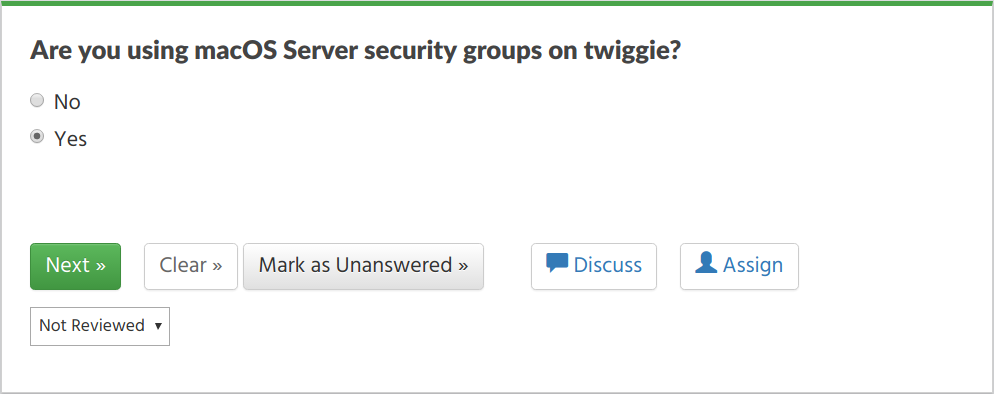

Automation API
==============

GovReady Q Compliance Apps can be updated with information gathered from live systems via the GovReady Q API. The benefit of this capability is that the documentation produced by GovReady Compliance Apps, such as System Security Plans (SSPs), can be assembled and updated with actual system data in an automated way.

Overview of the GovReady Q API
------------------------------

The GovReady Q API provides read and write access to the information stored in GovReady Q's question-and-answer data model. It is a RESTful API using HTTP GET and POST requests, API keys that are issued per user, and JSON for request and response data.

Each GovReady Compliance App provides a separate API, and each app's API is composed of fields for the same information the app would ask an end-user using the Q website in a web browser. The app's definition of questions to ask the end user (see [Modules, Questions, and Documents](Schema.html)) also define the data model of the API.

As an example, the screenshot below shows a demonstration of a macOS File Server compliance app. The app asks questions about the hostname of the server and the use of security groups.


The answers to these questions can be both read from Q and written to Q using a JSON data structure:

	{
	  "schema": "GovReady Q Project API 1.0",
	  "project": {
	    "file_server": {
	      "hostname": "twiggie",

	      "login_message": "/etc/issue:\n\n```Ubuntu 16.04.3 LTS \\n \\l```",
	      "login_message.html": "<p>/etc/issue:</p>\n<p><code>Ubuntu 16.04.3 LTS
	           \\n \\l</code></p>",

	      "using_security_groups": "yes",
	      "using_security_groups.text": "Yes"

	      "security_groups_description": "There are 17 UNIX groups: `adm` (2 users:
	      	   `syslog`, `user`), `audio` (2 users: `speech-dispatcher`, `pulse`), ...",
	      "security_groups_description.html": "<p>There are 17 UNIX groups: <code>
	           adm</code> (2 users: <code>syslog</code>, <code>user</code>), ..."
	    }
	  }
	}

The second question, shown below, is a yes-no question. In the web browser this question appears as a radio select question with Yes and No choices. In the JSON data structure, shown above, it is encoded as the JSON strings `"yes"` or `"no"`.



Each compliance app that has been started in GovReady Q and added to a project folder provides an `API Docs` page with samples and data schema documentation:


Using the Compliance API
------------------------

To use a compliance app API, an app must already be started in GovReady Q by adding it to a project folder **and** its modules must be started (but need not be completed) for them to be accessible from the API.

### API keys

Every call to the API requires an API key. Each user has three API keys listed on their API Keys page, which can be found in the user drop-down menu on Q: a read-only API key, a read-write API key, and a write-only API key:

* The read-only API key gives external tools the ability to see all data values that the associated user can see on Q, but the API key cannot be used to change any data values.

* The read-write API key gives external tools the ability to see and make changes to anything the associated user can see and make changes to on Q. 

* The write-only API key gives external tools the ability to make changes to anything the associated user can make changes to on Q but does not include the abiliy to see any data values stored in Q. The write-only key is useful in situations where the external tool needs to be able to upload data but does not need to read existing data values.

### Getting data from the app using the GET API

Project data can be read from the API using an HTTP GET request to a URL of the following pattern:

```{site base URL}/api/v1/organizations/{organization subdomain}/projects/{project id}/answers```

The complete URL can be found on the `API Docs` page for a compliance app that has been started and added to a project folder.

An API key must be passed in the HTTP `Authorization` header. You can get your API key from the API Keys page, which is found in the site header menu in the user drop-down.

The API response is a JSON data structure similar to the example above. The schema of the response object is documented on the app's `API Docs` page. Further information can also be found below.

If you are using an operating system with a command line and the `curl` tool, you can try out the API by running:

	curl --header "Authorization: {your-api-key}" \
	  {site base URL}/api/v1/organizations/{organization subdomain}/projects/{project id}/answers

### Updating data using a POST request with form data

There are two types of POST requests that can be used to update app data. In the first type, described in this section, data values are provided as key-value pairs using the regular web browser form submission method. (In the second form, described below, answers are provided using a JSON data structure that is formatted the same as the JSON data structure returned by a GET request, which may be more appropriate when submitting non-textual and non-binary content.) 

In each of the key-value pairs submitted in the POST request, the *key* is a dotted-path question ID. The key always begins with `project.` and is followed by the property names on the path to the question being updated, according to the JSON data structure, with property names separated by the `.` character.

The *value* of each key-value pair is an answer submitted either as plain text or, for file-type questions, as a binary file. If submitted as plain text and the question expects non-text data, such as a number, the value will be converted. When uploading a binary file, the [multipart/form-data](https://tools.ietf.org/html/rfc2388) content type must be used for the POST request.

As with the GET API, an API key must be passed in the HTTP <code>Authorization</code> header. An API key with write permission must be used. You can get an API key from the API keys page on your Q site.

If you are using an operating system with a command line and the `curl` tool, you can try out the API by running:

    curl \
      --header "Authorization: <i>your-api-key</i>" \
      -F project.question.subquestion1=datavalue \
      -F project.question.subquestion2=datavalue \
	  {site base URL}/api/v1/organizations/{organization subdomain}/projects/{project id}/answers

For a file upload, use `-F @filename.ext`. `curl`&rsquo;s `-d` option can be used in place of `-F` if none of the fields are file uploads.

### Updating data using a POST request with JSON

Use a POST request instead a GET request to the same URL to update data stored in the app. Data values to save in the app are included in the request body as JSON in the same format as returned by the GET request.

The POST request body always includes:

	{
	  "schema": "GovReady Q Project API 1.0",
	  "project": {
	    ...
	  }
	}

Answer data is placed inside the `project` field.

As with the GET API, an API key must be passed in the HTTP `Authorization` header. An API key with write permission must be used. You can get your API key from the API Keys page, which is found in the site header menu in the user drop-down.

If you are using an operating system with a command line and the `curl` tool, you can try out the API by placing the JSON request data in a file named `data.json` and then running:

    curl --header "Authorization: {your-api-key}" \
      -XPOST --data @data.json --header "Content-Type: application/json" \
	  {site base URL}/api/v1/organizations/{organization subdomain}/projects/{project id}/answers

API Data Schema
---------------

Each compliance app documents its data schema on its API Docs page, which can be found inside the compliance app after it has been started and added to a project folder.

Each question defined by the app --- which it would ask an end-user when in a web browser --- is exposed as a field in the JSON data structure. The field types are:

* Text, password, email-address, and URL fields: Encoded as a JSON string. Email-address fields must contain valid email addresses. URL fields must contain valid URLs.

* Long text fields, which hold multi-paragraph text: Encoded as a JSON string with formatting expressed in [CommonMark](http://commonmark.org/) (i.e. Markdown).

* Date fields: Encoded as a JSON string in YYYY-MM-DD format.

* Single-choice and yes-no fields: Encoded as a JSON string holding a programmatic identifier for the selected choice. Yes-no fields use the identifiers `yes` and `no`.

* Multiple-choice fields: Encoded as a JSON array of strings, where each string is a programmatic identifier for a selected choice.

* Integer and real number fields: Encoded as a JSON number. Integer fields must contain integer values.

* File fields: Encoded as a JSON object containing the properties `url` (a link to download the file content), `type` (the MIME type), and `size` (the size of the file in bytes).

* "Module" questions create recursive structures and are encoded as JSON objects. "Module-set" questions are encoded as JSON arrays of JSON objects.

All fields can also hold `null`, which indicates the question has been explicitly "skipped." If a question is unanswered, it does not appear in the API.

Single-choice, multiple-choice, and yes-no fields also appear in human-readable form as a second read-only field that uses a `.text` suffix in the field's name. Long text fields have an HTML display form, in which the CommonMark is pre-rendered, in a parallel field with a `.html` suffix in the field's name. These fields cannot be used in the POST API.

More information about Q's data types can be found in [Modules, Questions, and Documents](Schema.html).
