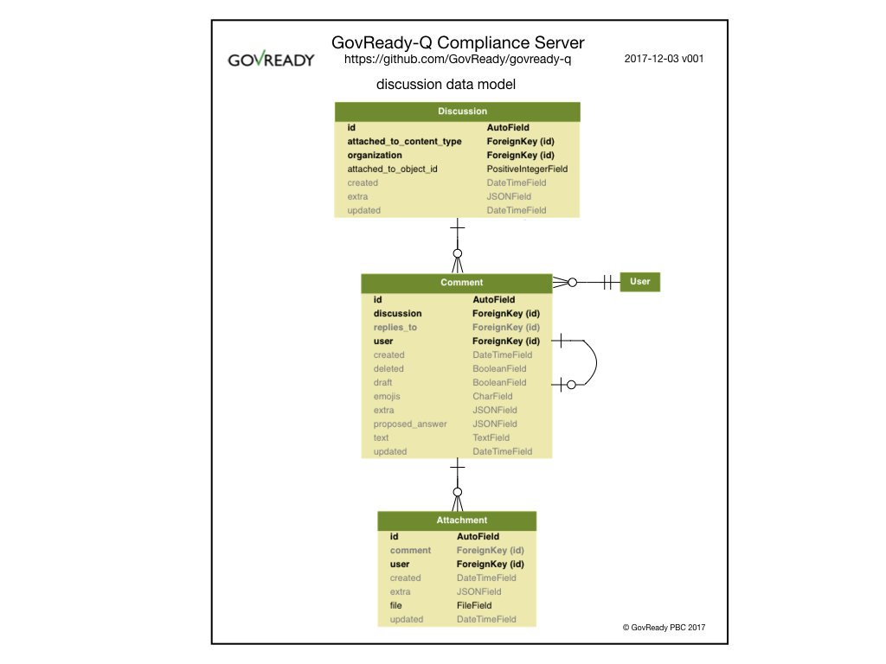

Discussions
===========

The diagram below provides a summary representation of GovReady-Q’s
Django ``discussion`` data model that handles discussions, comments, and
invitations.

   Discussion data model (not all tables represented)

A single discussion can be instantiated and associated to any task (task
~= “question”). A discussion can have multiple comments. Comments can
have multiple attachments.
