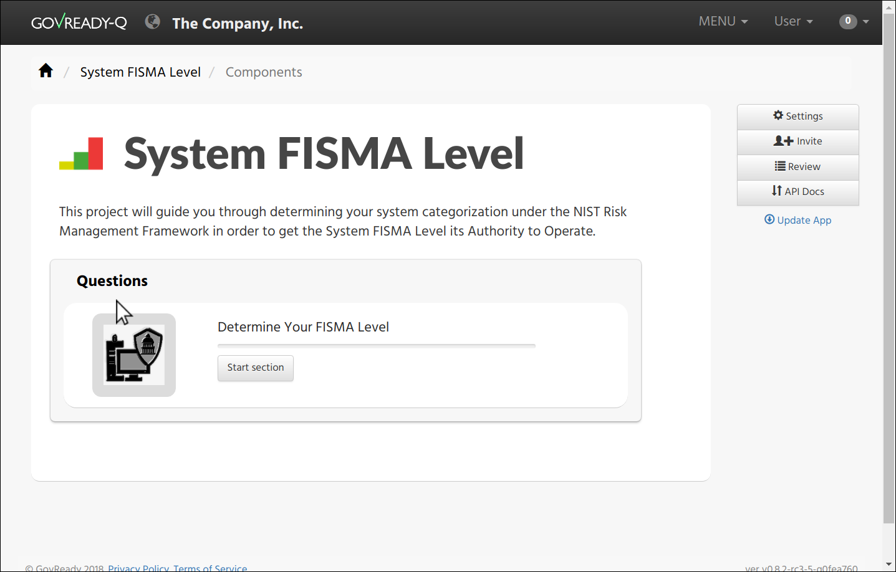
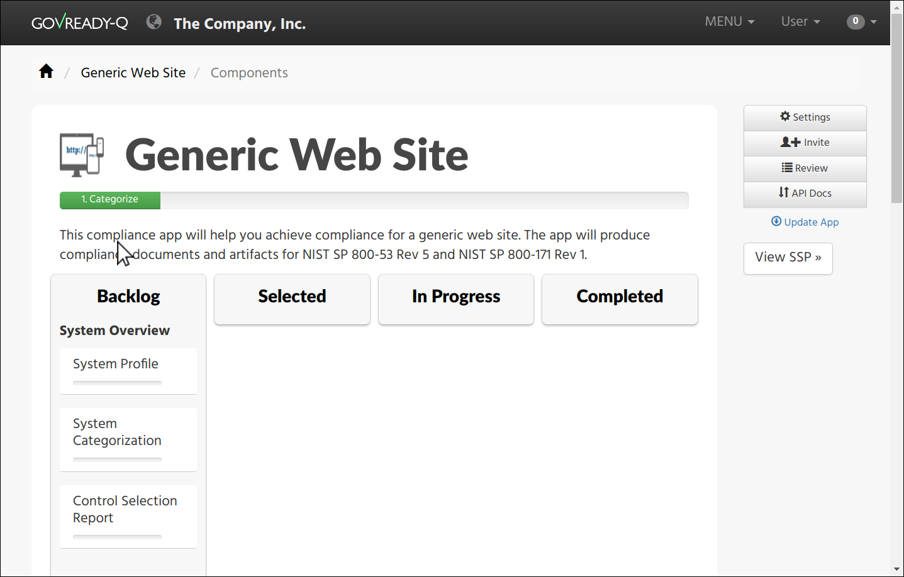
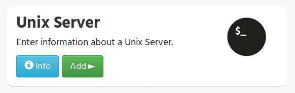

Compliance Apps, Modules, Questions, Tasks, and Answers
=======================================================

GovReady-Q is a governance, risk, and compliance platform for creating automated compliance processes ranging from gathering information from persons and computers to generating compliance artifacts.

Information gathering is at the heart of GovReady-Q's `guidedmodules` data model, which handles compliance apps, modules, questions, tasks, and answers. Eight database tables make up the `guidedmodules` data model. The complete data model spans three categories:

1. Compliance apps, which are reusable packages of questions, business logic, and document templates, are defined by the database tables `AppSource`, `AppVersion`, `Module`, `ModuleQuestion`, and `ModuleAsset`. Many compliance apps, and different versions of the same compliance app, can be in use simultaneously.
2. Information submitted by end-users to answer compliance app questions, as well as information submitted through the GovReady-Q API, is stored in the database tables `Task`, `TaskAnswer`, and `TaskAnswerHistory`.
3. Imputed answers and documents generated by the business logic stored in compliance apps, which are computed on-the-fly.

The tables are described is additional detail below and their relationships are summarized in the following diagram:


<!-- The image above was generated with:

     python3 manage.py graph_models guidedmodules --disable-sort-fields  -X InstrumentationEvent > diagram.dot
     dot diagram.dot -Tsvg > diagram.svg
-->

Compliance Apps (Questions, Business Logic, and Templates)
----------------------------------------------------------

The smallest unit of a compliance app is a `Question`. Questions come in different types, such as text, number, and date ([full list](Schema.html)). Questions are grouped into questionnaires called `Modules`. And Modules are grouped into `AppVersion`, which are the versions of a compliance app that are loaded into the GovReady-Q database. AppVersions are loaded from AppSources, which define how to load compliance apps from remote sources such as GitHub or an on-premesis enterprise source control system.

`AppVersion`, `Modules`, and `Questions` define the structure of a compliance app but do not store any user-submitted content. Separating structure from content is a common pattern in application design and is motivated by several GovReady-Q goals:

* Compliance apps are reusable and can be easily loaded into different installs of GovReady-Q at different organizations.
* Anyone can author compliance apps and they can be kept private or shared publicly.
* One type of Question allows the user to choose a complete set of answers to another Module, which allows question answers (i.e. user data) to be accessed from the business logic and templates of not only the Modules the Questions are defined in but also from other Modules and even other compliance apps.
* Compliance apps are versioned and apps that have been started by users can be updated in non-destructive ways, preserving answered questionnaires over the course of years,

GovReady-Q administrators will configure GovReady-Q with an `AppSource` record for each source of compliance apps that will be made available to GovReady-Q users. Each AppSource has a "slug," which is its unique name on the GovReady-Q installation. An AppSource also defines a remote location --- such as a GitHub repository, local directory, or on-premise git server --- to query for compliance apps, which will be listed in the app catalog. A typical GovReady-Q installation might have one AppSource providing compliance apps published by GovReady PBC and a second AppSource for providing compliance apps defined by the organization. Each AppSource defines the remote location as well as local permissions such as which compliance apps in the store to make available to GovReady-Q users and Organizations. See [App Sources](AppSources.html) for more information.

Each time a compliance app is started by a user, an `AppSource` is queried for the latest version of the selected compliance app and an `AppVersion` is created that holds the complete set of questions, business logic, and templates defined in that version of the compliance app. Therefore there will be a separate AppVersion in the database for every version of every compliance app being used by GovReady-Q users.

Each AppVersion links back to the AppSource it was created from (the "source" field) and holds the name it was given (the "appname" field). Each AppVersion brings along with it the `Modules` and `Questions` defined in that version of the compliance app. In other words, Modules and Questions are specific to a AppVersion. Therefore if two versions of a compliane app are present in the database, a question that exists in both versions of the app is represented as two Question records --- one for each version of the app. Similarly, there will be (at least) two Modules, one for each version of the app.

All compliance apps have at least two `Modules`. The first module, whose "module_name" identifier is always `app`, defines the layout of the starting page of a compliance app, which can list one or more `Modules` to complete:

<!-- ./manage.py test_screenshots --app-source '{ "slug": "apps", "type": "git", "url": "https://github.com/GovReady/govready-apps-dev", "path": "apps" }' --app 'apps/fisma_level' --path test_screenshots/ --size 1024x768 -->



or a collection of modules and slots to start other compliance apps:

<!-- ./manage.py test_screenshots --app-source '{ "slug": "apps", "type": "git", "url": "https://github.com/GovReady/govready-apps-dev", "path": "apps" }' --app 'apps/generic-web-site' --path test_screenshots/ --size 1024x768 -->



In both cases, the "cards" that represent modules to answer or slots for compliance apps to start are defined by `Questions` in the "app" `Module`. When a user starts a module or selects a compliance app, that is recorded in the database as *answering* the respective Question in the "app" Module (more on that below).

Besides listing questions, `Modules` also define zero or more output documents. Each output document is generated by combining a template stored in the Module with user answers.

Similar to Modules, `ModuleQuestions` have a "key" field that uniquely identifies them within the Module they are defined in. ModuleQuestions store the question type (text, date, etc.), the prompt shown to users, impute conditions (see below), and other metadata.

`ModuleAsset`s store a compliance app's static assets used by the app's templates. These assets often appear as images or other embedded media in output documents generated by the compliance app.

User Answers (Tasks and Answers)
--------------------------------

When a user is completing the questions in a compliance app, their answers are stored in a separate set of database tables distinct from the tables used to store compliance app questions, business logic, and templates. The tables that hold answers are `Task`, `TaskAnwser`, and `TaskAnswerHistory`.

`Task` and `TaskAnswer` are parallel tables to `Module` and `ModuleQuestion` and are related to where user answers are stored. A `Task` is the instantiation of a `Module` that a GovReady-Q user or set of users are completing. A `TaskAnswer` is the instantiation of a `ModuleQuestion` that a GovReady-Q user has answered. All of the Tasks instantiated together for the same compliance app are related through the "project" field.

`TaskAnswerHistory` stores the complete history of user answers related to a TaskAnswer, i.e. to an instantiated question. The *current* answer to a question and its associated metadata are stored in the most recent TaskAnswerHistory record for a particular TaskAnswer (the one with the highest "id" value --- "id"s are assigned to answers in strictly increasing order). Therefore only the most recent TaskAnswerHistory record for a TaskAnswer holds a current answer, and earlier TaskAnswerHistory records are for audit logging and tracking changes.

TaskAnswerHistory records have a "stored_value" field which holds the user's answer encoded in JSON, other metadata such as "answered_by" for which user provided the answer, "skipped_reason" and "unsure" which are flags set if the user skipped the question or wants to return to it later, and "reviewed" which holds workflow review state (e.g. if a reviewer marks the answer as approved).

 This data model supports GovReady-Q design goals, such as:

* Compliance app modules and questions can be assigned to different users to answer.
* The answer to questions may change while a complete history of answers are preserved in an immutable record, including preserving past answer metadata such as who answered the question and whether the answer was approved by a reviewer.
* Answers are strongly typed: text, numbers, dates, choices, and so on are encoded in a JSON representation that preserves their data type.
* All questions can be skipped by storing `null` in "stored_value."

Imputed Answers and Output Documents
------------------------------------

Compliance apps hold business logic and templates that are used to "impute" answers to questions and generate output documents, respectively. These computational outputs are not stored in the database. Instead, they are computed on-the-fly by GovReady-Q as they are needed, and the results of the computations are cached so long as they remain valid.

### Imputed Answers

Imputation uses business logic rules to infer the answer to questions based on previous answers to questions. Imputation is used for a variety of purposes, such as:

* Hiding questions that are not applicable based on the answers to previous questions, by imputing `null` as the answer to the question.
* Pre-answering questions when the answer is known based on the answers to previous questions.
* Running business logic computations, such as computing a grade or gap analysis, and storing the result of the computation as the answer to the imputed question.

Questions whose answers are imputed are not asked of the user --- the user may never see these questions at all. Some questions are designed to always be imputed to support the execution of business logic rules.

The results of imputation are not stored in the database because they are computed on-the-fly to ensure that the GovReady-Q always runs the business logic rules on the most recent, current set of answers to the questions. As a result, there may be no `TaskAnswer` or `TaskAnswerHistory` records for questions that have been imputed.

In certain circumstances, a question's answer may be imputed after a user already provided an answer to the question. In such cases, the user's answer remains in the database and appears in the database as the current answer to the question. However, when visiting GovReady-Q, imputed answers supersede user answers and only the imputed value will be used.

### Output Documents

Compliance apps produce output documents. Each output document is generated by combining a template with the answers to questions (both user-inputted and imputed). Templates are typically written using Markdown syntax and are displayed in GovReady-Q as HTML documents, but they typically can also be downloaded in other formats such as a Microsoft Word document or PDF.

As with imputation, output documents are generated on-the-fly when they are viewed by GovReady-Q users. The generated documents are not stored in the database because they are computed on-the-fly to ensure that the GovReady-Q always runs the template on the most recent, current set of answers to the Module's questions. As a result, there is no database table for output documents.


Database Query Examples
-----------------------

### Example: Find all approved answers to a particular question across users and tasks

*Scenario: Unix File Server App contains a text-type question named "Hostname". Many users have finished answering all of the questions in the app. However, our reviewers have only approved some of the answers so far. I want to write an SQL query to return all approved answers to the "Hostname" question.*

In this section, we will build up an SQL query to extract the data identified in the scenario. The query will be built progressively over the next several sections to explain the rationale behind the GovReady-Q data model. Some of GovReady-Q's design choices --- including separating the definitions of compliance apps from user-submitted data, as well as recording an immutable history of user answers --- are reflected in the SQL queries below. The complete SQL query is shown at the end.

You may prefer to use the GovReady-Q API instead of writing a low-level database query, but this example is illustrative for understanding GovReady-Q's data model no matter which method you use to query the data.

#### Find the AppVersions

First locate the `AppSource` "slug" and `AppVersion` "appname" that identifies a compliance app in GovReady-Q's database. Find the app in the compliance apps catalog and click its *Info* button:



The slug and the appname of the compliance app can be found in the URL:

> http://mygovreadyq/store/**myapps**/**unix_file_server**

In this case the slug is "myapps" and the appname is "unix_file_server". These two fields identify the compliance app across its versions.

Construct an SQL query to return the numeric IDs of the AppVersions in the database for this compliance app. Each AppVersion may be a different version of the compliance app or a different instance of the same app in use by different users.

```sql
SELECT guidedmodules_appversion.id
FROM guidedmodules_appversion
LEFT JOIN guidedmodules_appsource
       ON guidedmodules_appsource.id = guidedmodules_appversion.source_id
WHERE guidedmodules_appsource.slug = "myapps"
  AND guidedmodules_appversion.appname = "unix_file_server";
```

This query will be adapted in the next section to find the hostname question.

#### Find the ModuleQuestions

Consult the compliance app source code YAML files to determine the "module_name" of the `Module` and "key" of the `ModuleQuestion` --- which are in the "id" fields in the YAML file.


The `Module` containing the hostname question has "file_server" as its module_name, and the `ModuleQuestion`'s key is "hostname."

Construct a preliminary SQL query to find all of the `ModuleQuestion` records for this question:

```sql
SELECT guidedmodules_modulequestion.id
FROM guidedmodules_modulequestion
LEFT JOIN guidedmodules_module
       ON guidedmodules_module.id = guidedmodules_modulequestion.module_id
WHERE guidedmodules_module.module_name = "file_server"
  AND guidedmodules_modulequestion.key = "hostname";
```

This query might be too broad --- it does not restrict the questions to those defined in the Unix File Server compliance app. There might be other compliance apps that use the same module_name and question key. Combine the first two queries to ensure only questions in the Unix File Server app are returned using a LEFT JOIN to bridge the tables:

```sql
SELECT guidedmodules_modulequestion.id
FROM guidedmodules_modulequestion
LEFT JOIN guidedmodules_appsource
       ON guidedmodules_appsource.id = guidedmodules_appversion.source_id
LEFT JOIN guidedmodules_appversion
       ON guidedmodules_appversion.id = guidedmodules_module.app_id
LEFT JOIN guidedmodules_module
       ON guidedmodules_module.id = guidedmodules_modulequestion.module_id
WHERE guidedmodules_appsource.slug = "myapps"
  AND guidedmodules_appversion.appname = "unix_file_server"
  AND guidedmodules_module.module_name = "file_server"
  AND guidedmodules_modulequestion.key = "hostname";
```

We'll call this query `MODULE_QUESTIONS` --- we'll use it as a sub-query in the next step.

#### Find the history of answers

GovReady-Q has been designed so that separate tables contain the definition of the question and the user-submitted answers to the question. Each answer is connected to a `ModuleQuestion` through a `TaskAnswer`. Locate the TaskAnswers for the questions:

```sql
SELECT guidedmodules_taskanswer.id
FROM guidedmodules_taskanswer
WHERE guidedmodules_taskanswer.question_id IN (MODULE_QUESTIONS);
```

Replace `MODULE_QUESTIONS` with the preceding SQL query, inserting it as a sub-query.

The TaskAnswer table does not hold user answers, however. Answers are stored in the `TaskAnswerHistory` table where the complete history of answers to questions are stored. We'll now adapt the query to fetch the history of answers to this question, including some metadata about the answers, by using a LEFT JOIN to bridge the TaskAnswerHistory table and the TaskAnswer table:

```sql
SELECT guidedmodules_taskanswer.id, answer.stored_value, answer.created, siteapp_user.username
FROM guidedmodules_taskanswerhistory AS answer
LEFT JOIN guidedmodules_taskanswer
       ON guidedmodules_taskanswer.id = answer.taskanswer_id
LEFT JOIN siteapp_user
       ON siteapp_user.id = answer.answered_by_id
WHERE guidedmodules_taskanswer.question_id IN (MODULE_QUESTIONS);
```

Here is an example result:

| Task Answer | Stored Value | Created | Username |
|-------------|--------------|---------|----------|
| 10 | "server1.company.com" | 2018-05-19 20:33 | user1 |
| 10 | "server2.company.com" | 2018-05-20 10:15 | user1 |
| 10 | null                  | 2018-05-20 10:35 | user1 |
| 11 | "server2.company.com" | 2018-05-19 16:20 | user2 |

This is the complete history of answers for the "hostname" question in two separate Tasks, i.e. two instantiations of the compliance app started by different users. The two instantiations of the question are identified by their `TaskAnswer` "id"s, 10 and 11.

The history for TaskAnswer 10 has three rows. Two rows -- the first two --- reflect old answers to questions. This indicates the user returned to the question twice. On the first occasion, the user replaced the original answer with `"server2.company.com"`. On the second revisit, the user replaced the original answer with `null`, clearing the answer because the user decided they didn't know the answer or the question didn't apply to them.

The second TaskAnswer was answered once.

We'll adapt this query in the next step to fetch just the current (most recent) answer in each Task.

#### Find the current answer to each question

The current answer for each question is stored in the `TaskAnswerHistory` record with the highest "id" for each TaskAnswer. The IDs in the TaskAnswerHistory table are assigned strictly sequentially. To determine which TaskAnswerHistory record holds the current answer, use `GROUP BY` and `max` to fetch one TaskAnswerHistory for each TaskAnswer:

```sql
SELECT max(answer.id)
FROM guidedmodules_taskanswerhistory AS answer
LEFT JOIN guidedmodules_taskanswer
       ON guidedmodules_taskanswer.id = answer.taskanswer_id
LEFT JOIN siteapp_user
       ON siteapp_user.id = answer.answered_by_id
WHERE guidedmodules_taskanswer.question_id IN (MODULE_QUESTIONS)
GROUP BY guidedmodules_taskanswer.id;
```

| id  |
|-----|
| 103 |
| 104 |

This result holds the current answers to the hostname question. We'll call this query `CURRENT_ANSWERS` --- we'll use it as a sub-query in the next query.

To fetch the answers and metadata but for the current answers, we'll query the `TaskAnswerHistory` table using the `CURRENT_ANSWERS` query as a sub-query to identify just the rows that are current answers to questions:

```sql
SELECT taskanswer_id, stored_value, created, username, reviewed
FROM guidedmodules_taskanswerhistory
LEFT JOIN siteapp_user
       ON siteapp_user.id = answered_by_id
WHERE guidedmodules_taskanswerhistory.id IN (CURRENT_ANSWERS);
```

Here is an example result:

| Task Answer | Stored Value | Created | Username | Reviewed |
|-------------|--------------|---------|----------| -------- |
| 10 | null                  | 2018-05-20 10:35 | user1 | 0 |
| 11 | "server2.company.com" | 2018-05-19 16:20 | user2 | 2 |

This result holds the current answers to the Unix File Server hostname question across all instances of the compliance app in the GovReady-Q installation. Notice that the rows in the previous table that represented replaced answers to the first TaskAnswer are omitted from the results in this query and only the current answer for each `Task` is included.

The "stored_value" column holds the user's answer encoded in JSON. In JSON, text (strings) are enclosed in double quotes. Therefore we know that the second answer is text. In JSON, `null` (without double quotes around it) represents an empty value --- in GovReady-Q, that means the user skipped the question choosing *I Don't Know*, *It Doesn't Apply*, or *I'll Come Back*.

We'll modify this query in the next section to filter on the reviewed status of each answer.

### Filter on approved answers

The "reviewed" field of `TaskAnswerHistory` stores GovReady-Q's simple workflow status of the answer. The values are `0` (not reviewed), `1` (reviewed), and `2` (approved). To select just approved answers, add a WHERE clause to the previous SQL query:

```sql
SELECT taskanswer_id, stored_value, created, username, reviewed
FROM guidedmodules_taskanswerhistory
LEFT JOIN siteapp_user
       ON siteapp_user.id = answered_by_id
WHERE guidedmodules_taskanswerhistory.id IN (CURRENT_ANSWERS)
  AND reviewed = 2;
```

The query extracts the answers in a structure similar to the following table:

| Task Answer | Stored Value | Created | Username | Reviewed |
|-------------|--------------|---------|----------| -------- |
| 11 | "server2.company.com" | 2018-05-19 16:20 | user2 | 2 |


This is the complete query to extract the approved answers to the hostname question in the Unix File Server compliance app. The query has been simplified by replacing a sub-query with `CURRENT_ANSWERS`, which itself has a sub-query that has been replaced by `MODULE_QUESTIONS`. Both sub-queries can be found above.
