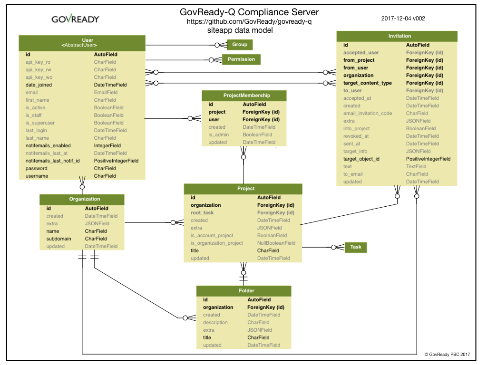

Users, Organizations, Projects, Folders, and Invitations
========================================================

The diagram below provides a summary representation of GovReady-Q's Django `siteapp` data model, which handles users, organizations, projects and folders, and invitations.

GovReady-Q is multi-tenant. The siteapp data model represents users who are uniquely associated with an organization and have membership in different organization projects. Users must be invited to projects.

Access control is based on organization and projects. Information cannot be shared across organizations and only limited information can be shared across projects within an organization.
