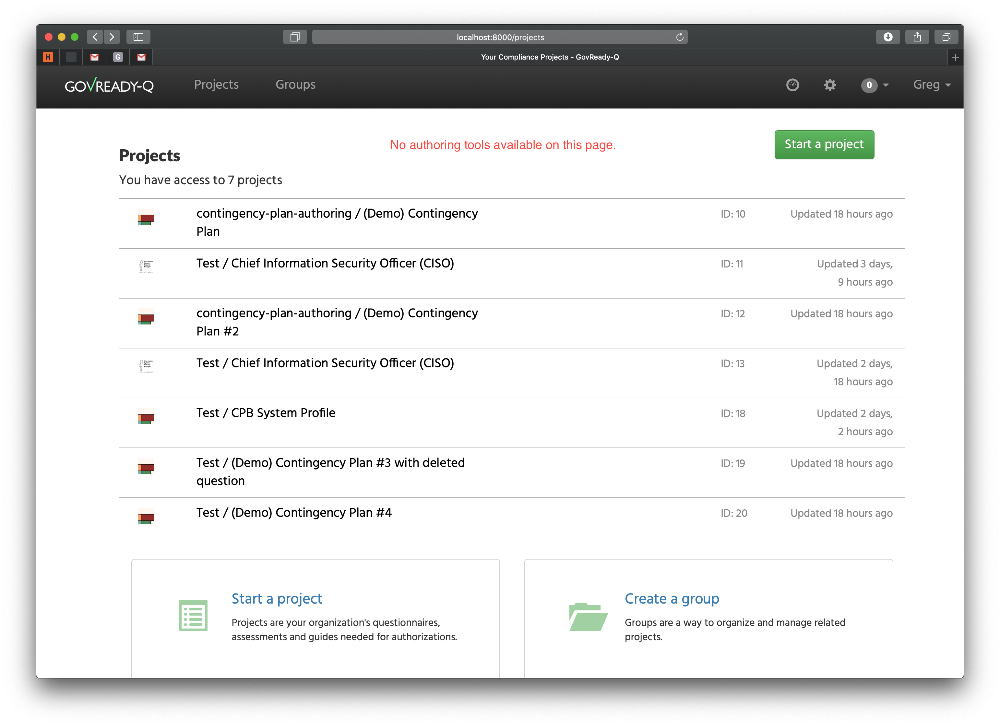
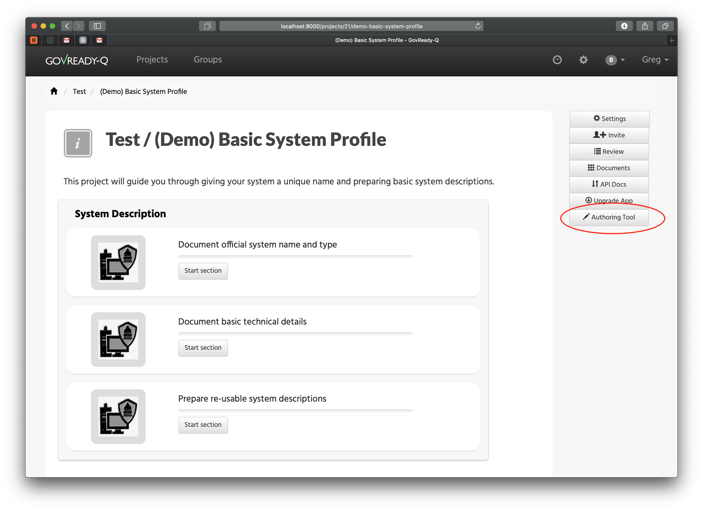
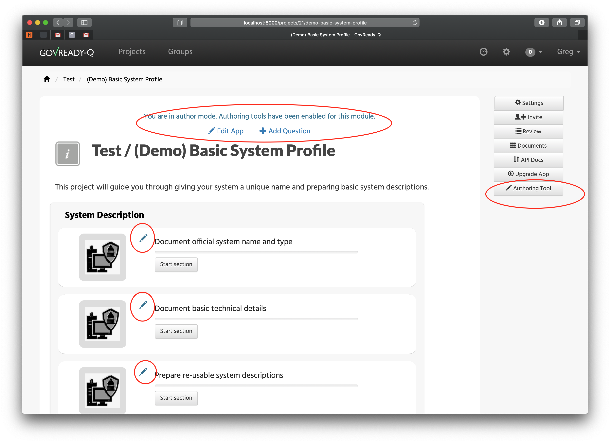
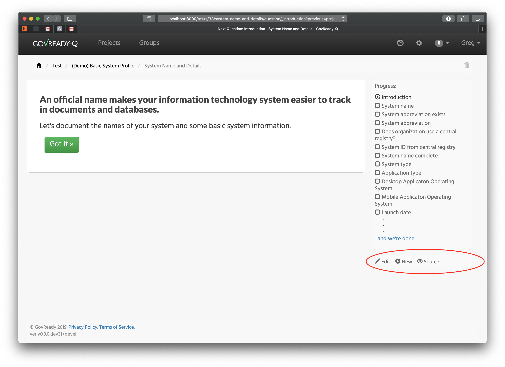
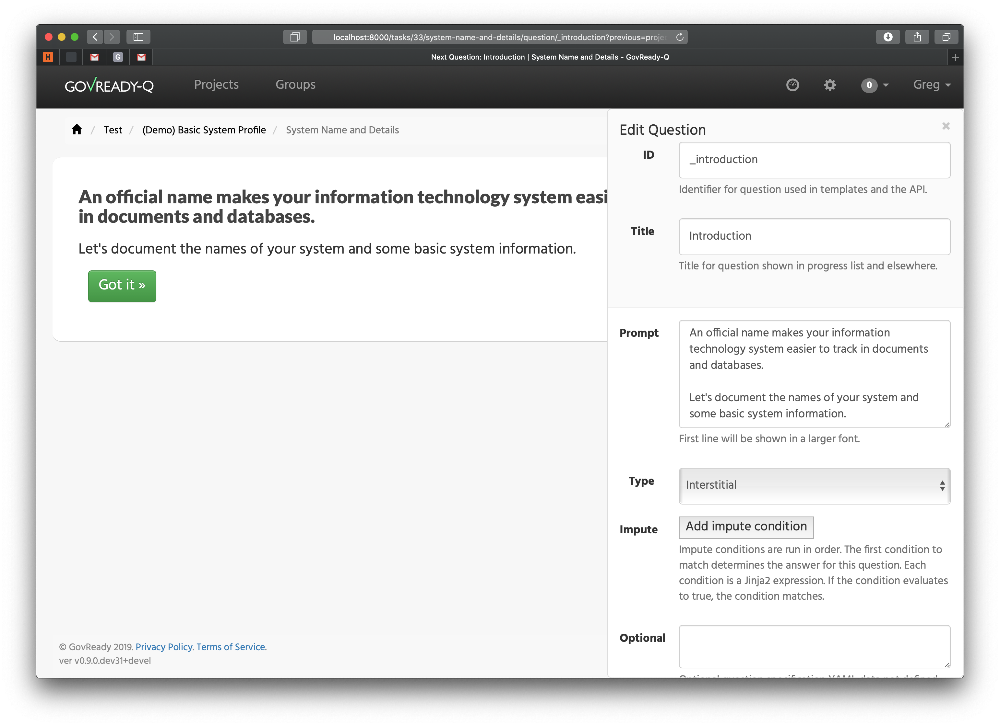

# FAQ

#### Am I using the most up to date version of GovReady-Q? 

On the home page of GovReady-Q, you can find the version release number on the bottom right of the screen. Our most up to date release is Version 0.9.0. If you are currently using a previous version, we strongly recommended that you explore our most recent release of [Version 0.9.0.](https://govready-q.readthedocs.io/en/latest/version.0.9.0.html)  It has faster performance and improved features as well as an easier initial deployment and configuration.

#### How do I deploy using Docker containers? How do I deploy directly on a VM like ec2?

To deploy using Docker containers, you can follow our Docker deployment instructions [here](https://hub.docker.com/r/govready/govready-q-0.9.0.dev/). To debug, you should refer to the following logs [here](https://govready-q.readthedocs.io/en/latest/deploy_docker.html#logs-for-debugging).

Regarding deploying directly on an ec2 instance, reach out to us at info@GovReady.com and tell us about your configuration. We may be able to quickly model it, tell you where the logs are, and replicate the issue.

#### I am having issues connecting to servers in AWS. What should I do?

Firstly, make sure `DEBUG` is on by setting `DEBUG` to true in the `local/environment.json` file. One of the most common problems that occurs when connecting to AWS has to do with HOST name assignment. When deploying locally, our configuration takes care of the HOSTNAME with localhost. But when deploying remotely, you need to be explicit with setting the HOSTNAME or you get a "HOSTNAME Not Allowed" error. When DEBUG is set to false, the "HOSTNAME Not Allowed" error shows as an "Internal Server Error" in your browser. Read more about configuration variables [here](https://govready-q.readthedocs.io/en/latest/deploy_prod.html?highlight=environment.json#set-basic-configuration-variables).

#### I am having trouble setting my domains. What should I do?

In older versions of GovReady-Q, users would have to juggle whether you are setting up for a single tenant or multi-tenant with subdomains. We would reccomend updating to 0.9.0 becuase we did away with sub-domain multi-tenancy as it causes issues. You can read more about defining your host and organization parent domain [here](https://govready-q.readthedocs.io/en/latest/deploy_prod.html?highlight=hostname#remember-to-define-your-host1-and-organization-parent-domain).

#### Do I have access to the authoring tools? How do I use them?

Authoring tools are reserved for users with SuperAdmin permissions. If you are not an admin, reach out to your admin to get access to SuperAdmin permissions.

Your home page does not have any authoring tools. Click into a valid Project.

Once in a Project, access the tool bar on the right side of the screen. At the bottom of the tool bar there is an "Authoring Tool" button.

Clicking the "Authoring Tool" button will put you in "author mode" which allows for the editing of your assessment.

Clicking into a specific module in your assessment, you can click the editing option at the bottom right of the screen. This enables you to edit this page of the assessment.

You can edit each question in your assessment to fit your needs. You can change the Title, what the questions asks the user, the type of question that will be displayed (multiple choice, file upload, short text, long text, etc.), and adding optional text. Also, you can use the impute section to add an impute condition that can connect this module to another modules allowing for "forms within forms".

NOTE: AFTER YOU EDIT QUESTIONS, CHANGES ARE SAVED IN THE DATABASE BUT *NOT* ADDED BACK INTO ANY SOURCE REPOSITORY HOLDING THE QUESTIONS. CURRENTLY, YOU MUST VIEW "SOURCE" AND GRAB ALL YAML CONTENT FOR QUESTIONNAIRE AND MANUALLY UPDATE THE UPSTREAM REPO WITH THE QUESTIONS IN ORDER TO RELOAD QUESTION IN A NEW INSTALL.