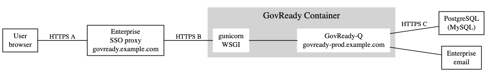

.. Copyright (C) 2020 GovReady PBC

.. _advanced_container_configuration_examples:

Advanced Container Configuration Examples
=========================================

Example 1 - Basic Container Deployment with HTTPS, Persistent Database
~~~~~~~~~~~~~~~~~~~~~~~~~~~~~~~~~~~~~~~~~~~~~~~~~~~~~~~~~~~~~~~~~~~~~~

Below is a diagram of an advanced configuration of GovReady-Q using a container, encrypted
HTTPS communications, and persistent database.

.. figure:: assets/diagram-arch-basic-https.png
   :scale: 100 %
   :alt: Deployment architecture behind enterprise Single Sign On proxy

..
    vizgraph for the diagram
    graph G {
    rankdir=LR;
    node [shape=rectangle border=black fontsize=11];
    edge [fontsize=10];
        subgraph cluster_0 {
            style=filled;
            color=lightgrey;
            node [style=filled,color=white];
            "gunicorn\nWSGI" -- "GovReady-Q\ngovready.example.com";
            label = "GovReady Container";
        }
        "User\nbrowser" -- "gunicorn\nWSGI" [label="HTTPS A"];
        "GovReady-Q\ngovready.example.com" -- "PostgreSQL\n(MySQL)" [label="HTTP B"];
    }

From left to right, this diagram shows the User browser connecting to the Green Unicorn ("gunicorn") WSGI (Web Server Gateway Interface)
running in the GovReady container via the encrypted link "HTTPS A". Green Unicorn terminates the HTTPS connection,
serves static assets, and forwards requests to the GovReady-Q application. Both Green Unicorn and GovReady-Q are running in the
GovReady container. The domain that users perceive as the address of GovReady-Q (e.g., govready.example.com) points to the GovReady container.

GovReady-Q communicates with its persistent database over connection "HTTP B" which is unencrypted because the
database is configured to only accept connections from the IP address of the GovReady container.

To operate correctly in this configuration, the following options would need to be set via environment variables,
the ``local/environment.json`` file, or by hardcoding your container's customized source code files.

-  ``HOST = govready.example.com`` - This tells GovReady-Q to set ``ALLOWED_HOSTS`` value in ``settings.py`` to ``govready.example.com`` permitting GovReady-Q to respond to requests made to that domain.
-  ``HTTPS = true`` - This tells GovReady-Q to rewrite URLs to start with ``https://`` instead of ``http://``.
-  ``DBURL = "postgresql://db_username:db_password@db_server.hostname.com/db_name",`` - This tells GovReady-Q how to connect to the database.
-  ``DEBUG = false`` - This tells GovReady-Q to not dump debug output to the browser.

You will need to copy the TLS certificates into the GovReady container (or make them available via a mounted volume)
and ``gunicorn.conf.py`` would need the following values (adjusted correctly for the path to the certificates):

::

   import multiprocessing
   bind = '0.0.0.0:8000'
   workers = 1
   worker_class = 'gevent'
   keepalive = 10
   ca_certs = '/etc/pki/root+intermediate.cer'
   keyfile = '/etc/pki/govready.key'
   certfile = '/etc/pki/govready.cer'
   ssl_version = 'TLSv1_2'

Example 2 - Enterprise Container Deployment with SSO, HTTPS, Persistent Database
~~~~~~~~~~~~~~~~~~~~~~~~~~~~~~~~~~~~~~~~~~~~~~~~~~~~~~~~~~~~~~~~~~~~~~~~~~~~~~~~

Below is a diagram of an advanced configuration of GovReady-Q regularly used in an enterprise deployment.

..
    vizgraph for the diagram
    graph G {
    rankdir=LR;
    node [shape=rectangle border=black fontsize=11];
    edge [fontsize=10];
        subgraph cluster_0 {
            style=filled;
            color=lightgrey;
            node [style=filled,color=white];
            "gunicorn\nWSGI" -- "GovReady-Q\ngovready-prod.example.com";
            label = "GovReady Container";
        }
           "User\nbrowser" -- "Enterprise\nSSO proxy\ngovready.example.com" [label="HTTPS A"];
           "Enterprise\nSSO proxy\ngovready.example.com" -- "gunicorn\nWSGI" [label="HTTPS B"];
           "GovReady-Q\ngovready-prod.example.com" -- "PostgreSQL\n(MySQL)" [label="HTTPS C"];
           "GovReady-Q\ngovready-prod.example.com" -- "Enterprise\nemail"
    }

From left to right, this diagram shows the User browser connecting to a enterprise SSO (Single Sign On) proxy
which connects to the GovReady-Q container. The connection "HTTPS A" is between the user browser and the SSO proxy.
The domain that users perceive as the address of GovReady-Q (e.g., govready.example.com) points to the SSO proxy.

The SSO proxy next connects to the Green Unicorn ("gunicorn") WSGI (Web Server Gateway Interface)
running in the GovReady container via the encrypted link "HTTPS B". Green Unicorn terminates the HTTPS connection,
serves static assets, and forwards request GovReady-Q application. Both Green Unicorn and GovReady-Q are running in the
GovReady container. Green Unicorn / GovReady-Q is assigned a domain users never see (e.g., govready-prod.example.com).

The final connection "HTTPS C" encrypts the communications between GovReady-Q and its persistent database.

Also represented in the diagram is a connection between GovReady-Q and the enterprise email service to send invites and notifications.

Depending on your deployment configuration, it may not be necessary to HTTPS encrypt connections "B" and "C".

To operate correctly in this configuration, the following options would need to be set via environment variables,
the ``local/environment.json`` file, or by hardcoding your container's customized source code files.

-  ``HOST = govready.example.com`` - This tells GovReady-Q to set ``ALLOWED_HOSTS`` value in ``settings.py`` to ``govready.example.com`` permitting GovReady-Q to respond to requests made to that domain.
-  ``HTTPS = true`` - This tells GovReady-Q to rewrite URLs to start with ``https://`` instead of ``http://``.
-  ``DBURL = "postgresql://db_username:db_password@db_server.hostname.com/db_name?sslmode=verify-full&sslrootcert=/path/to/pgsql.crt",`` - This tells GovReady-Q how to connect to the database securely.
-  ``email-host = smtp.company.org`` - This tells GovReady-Q the email host.
-  ``email-port = 587`` - This tells GovReady-Q the email port.
-  ``email-user = username`` - This tells GovReady-Q the email user.
-  ``email-pw = email_password`` - This tells GovReady-Q the email password.
-  ``email-domain = q.company.org`` - This tells GovReady-Q the email domain for messages.
-  ``DEBUG = false`` - This tells GovReady-Q to not dump debug output to the browser.

You will need to copy the TLS certificates into the GovReady container (or make them available via a mounted volume)
and  ``gunicorn.conf.py`` would need the following values (adjusted correctly for the path to the certificates):

::

   import multiprocessing
   bind = '0.0.0.0:8000'
   workers = 1
   worker_class = 'gevent'
   keepalive = 10
   ca_certs = '/etc/pki/root+intermediate.cer'
   keyfile = '/etc/pki/govready.key'
   certfile = '/etc/pki/govready.cer'
   ssl_version = 'TLSv1_2'

.. topic:: Next

    .. toctree::
        :maxdepth: 1

        advanced-container-config
