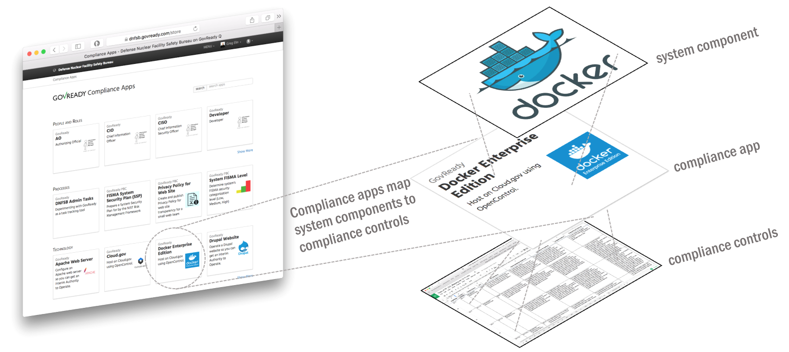

# What You Most Need to Know About GovReady-Q

## Why GovReady-Q?

<!-- Compliance is a huge value add for organizations because it scales trust. "Certified" means tested and approved.When pace and scale of an activity reaches a certain critical point, increases, quality assurance by individuals must be replaced with compliance regimes   on  risk/reward themselves  risk assessment with compliance regimes... 

For too many organizations, compliance has become the main bottleneck---the primary constraint---on the pace of innovation. Their staff experience assesments, documentation, and audits as exasperating invisible work holding back their ability to deliver new value.
-->

Everything about developing and deploying software is accelerating...except for compliance. Why is that? We think it's because:

* maintaining written documentation is too slow,
* pondering how jargon-laden control guidance applies is too hard,
* there's little reuse and no compliance documentation supply chain.

To remove the compliance bottleneck of taking months to authorize applications that deploy and re-deploy in minutes, assessments and authorizations need to be assembled from vetted, pre-fabricated components sourced from the same software supply chain we assemble applications.

And to do that, we need new tooling. Govready-Q is that tooling.

## How GovReady-Q Accelerates Compliance

**When you use or install GovReady-Q, you gain access to a marketplace of small, self-service compliance apps written by peers and vendors that map system components to security controls and guide you step-by-step through assessments and documentation.** 

As you and your teammates collaboratively answer questions, the compliance apps work with GovReady-Q platform to store your data in a relational database and automagically generate and maintain your compliance artifacts for auditors.

GovReady-Q's contribution to emerging field of Compliance-as-Code is figuring out the data abstractions for a shareable, reusable package to map the customizable relationship between a system component and a set of controls. The approach is innovative, yet familiar:

* it enables a hub/marketplace for community contributions.
* it extends the accepted practice of inherited controls to each system component;
* it enables a modern, user-friendly interface;
* it supports an agile, iterative workflow

.. ATTENTION::
   GovReady-Q software is "Beta" software best suited for early adopters needing faster compliance for DevSecOps.

<!-- GovReady-Q accelerates compliance by tackling the data management challenges of compliance. GovReady-Q does not scan servers or end-points. (Lots of tools do that.) Instead, GovReady-Q makes it easy to trace the relationship between system components and security control descriptions and evidence. 

GovReady-Q is open source GRC (Governance Risk & Compliance) platform for self-service preparation of compliance artifacts. It's ultra-friendly to use and ultra-compatible with Agile/DevOps Software Development Life Cycle.
-->

## GovReady-Q Philosophy

**Compliance is not security. Compliance scales security.**

Compliance is a technique humans have developed for enabling trust in systems that are too large and complex for individuals to assess trustworthiness. Compliance scales participation, attestation and verification of recommended practices.

* We love security and innovation and believe they enable each other.
* We believe security and compliance are standard, not premium add-ons.
* We view compliance as a by-product of a well-instrumented process.
* We value ease-of-use to increase adoption.
* We value automation to increase consistency.
* We see virtualization and DevOps enabling massive gains in security and compliance.

## GovReady-Q Features

* Step-by-step guidance through compliance processes
* Jargon-free approach to security controls and compliance
* Beautiful, easy-to-use questionnaires
* Discuss questions and answers in the tool instead of in email
* Support for multi-media for rich, clear communication
* Compliance-as-Code approach to documentation
* RESTful Automation API to integrate with DevOps pipeline and existing agents
* Innovative, reusable "Compliance Apps" model 
* Friendly Open Source license so you can start now

## Using Hosted GovReady-Q

There's nothing to install. [Q.GovReady.com](https://q.govready.com) is the hosted, multi-tenant version of GovReady-Q.

1. Visit [Q.GovReady.com](https://q.govready.com)
2. Fill out the form "About your organization" and "About you" to create your account
3. Don't worry about the Service Levels -- everything's available to everyone during the Beta phase
4. We'll contact you to help you get started

.. ATTENTION::
   We will help you get up and running during the current Beta phase of the project while we make getting started easier.

The hosted version is an excellent solution if have one project/system you are trying to get through NIST SP 800-53 or NIST SP 800-171 compliance, or you are have just trying to pull together a few specific compliance documents like your Privacy Policy or Rules of Behaivor. The hosted service operated by GovReady&reg; PBC, the company behind GovReady-Q Compliance Server.

If you have questions about if hosted version, email <a href="mailto:info@govready.com">info@govready.com</a>.

## Downloading GovReady-Q

| Downloading               | Where                                                                                                           |
|---------------------------|-----------------------------------------------------------------------------------------------------------------|
| Current release on Docker | [https://hub.docker.com/r/govready/govready-q/](https://hub.docker.com/r/govready/govready-q/)                  |
| Nightly Build on Docker   | [https://hub.docker.com/r/govready/govready-q-nightly/](https://hub.docker.com/r/govready/govready-q-nightly/)  |
| Clone the GitHub repo     | [https://github.com/govready/govready-q](https://github.com/govready/govready-q)                                |

## Installing GovReady-Q

| Deployment Guide                           | Where                                             |
|--------------------------------------------|---------------------------------------------------|
| Installing on Workstations for Development | [deploy_local_dev](deploy_local_dev.html)         |
| Deploying with Docker                      | [deploy_docker](deploy_docker.html)               |
| Deploying on RHEL 7 / CentOS 7             | [deploy_rhel7_centos7](deploy_rhel7_centos7.html) |
| Deploying on Ubuntu                        | [deploy_ubuntu](deploy_ubuntu.html)               |

## Finding Compliance Apps

Compliance Apps are GovReady-Q modular, shareable, reusable, data packages mapping the relationship between system components and security controls. See [Understanding Compliance Apps](Apps.html) for a more detailed description.

When using the Hosted Version of GovReady-Q, GovReady PBC manages the Compliance Apps available to your organization. Send email to <a href="mailto:info@govready.com">info@govready.com</a> to request changes.

The docker and downloaded version of GovReady-Q automatically loads a small set of example Compliance Apps. Compliance Apps are published in collections known as "AppSources" (e.g., repos). Here are a few:

* https://github.com/GovReady/govready-apps-dev

You can can show and hide compliance apps from the Django administration page at `main.localhost:8000/admin/guidedmodules/appsource/`.

To get started writing your own Compliance Apps see: [Creating Compliance Apps](CreatingApps.html)

## Support

Commercial support for GovReady-Q is provided by GovReady PBC. Email <a href="mailto:info@govready.com">info@govready.com</a>.

Sign up for Security Notifications email list at [GovReady Security Alerts](http://eepurl.com/dsi9YL)

## License / Credits

This repository is licensed under the [GNU GPL v3](https://github.com/GovReady/govready-q/blob/master/LICENSE.md).

* Emoji icons by http://emojione.com/developers/.
* Generic server icon by [Stock Image Folio from Noun Project](https://thenounproject.com/search/?q=computer&i=870428).

## About GovReady PBC

GovReady® PBC is Public Benefit Corporation whose mission is to lower the cost of innovation in digital services to citizens. GovReady’s innovative self-service IT compliance tool GovReady-Q was developed as part of a R&D contract to automate and lower the cost of cyber security compliance from the Department of Homeland Security, Science and Technology Directorate, Cyber Security Division. GovReady PBC is based in the greater Washingtong, DC metro aread.

